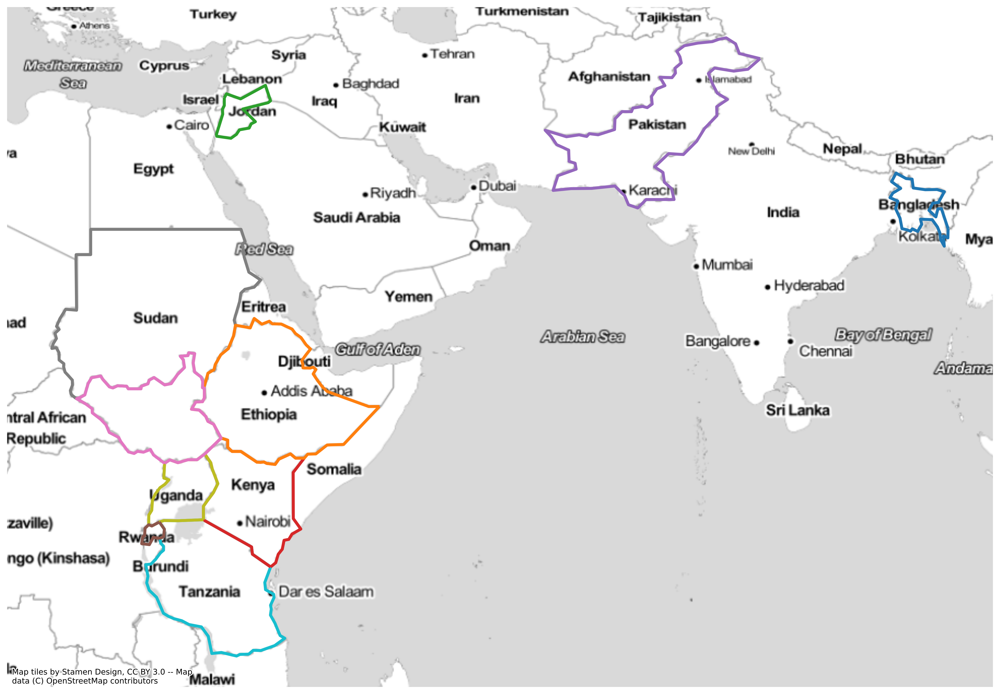
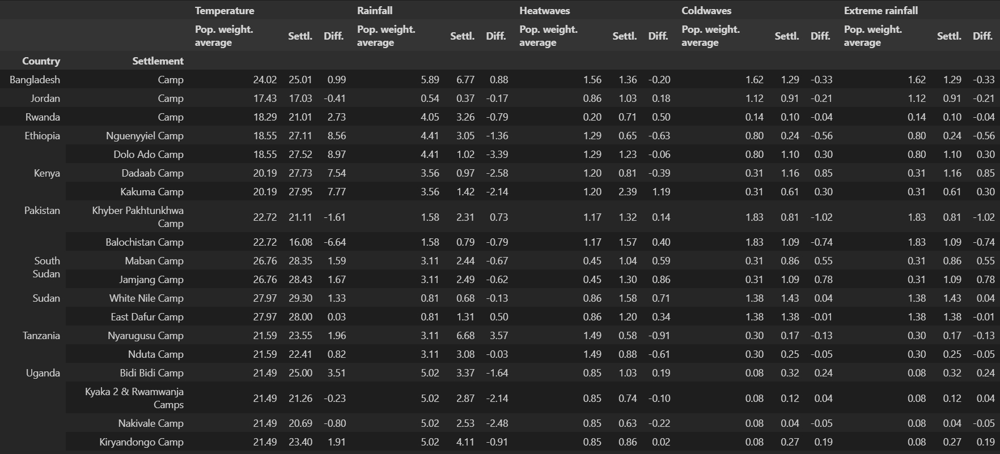

# exposure-of-refugee-camps
How exposed are refugee camps to various climatic shocks and stresses?

## Abstract
Involuntary displacement from conflict and other causes leads to clustering of refugees and internally displaced people, often in long-term settlements. Within refugee-hosting countries, refugee settlements are frequently located in isolated and remote areas, characterized by poor quality land and harsh climatic conditions. Yet, the exposure of refugee settlements to climatic events is under researched. In this article, we study the exposure of the 20 largest refugee settlements worldwide to extreme variations in climate conditions. The analysis integrates exposure of camp locations compared to the national averages for both slow and rapid onset events. Our findings show that most refugee settlements included face relatively high exposure to slow-onset events, including high temperatures (for settlements in Kenya, Ethiopia, Rwanda, Sudan, and Uganda), low temperatures (in the case of Jordan and Pakistan), and low levels of rainfall (in Ethiopia, Rwanda, Kenya, and Uganda) compared to national averages. Our findings for rapid- onset events – heatwaves, coldwaves and extreme rainfall – are less conclusive compared to country trends, although we find relatively high exposure to extreme rainfall in Cox’s Bazar, Bangladesh. Our analysis confirms that refugee populations are exposed to extreme weather conditions post-displacement, which, in combination with their socio-political exclusion, poses a threat to wellbeing and increased marginalization. Our findings call for an inclusive and integrated approach, including refugees and their host communities, in designing climate adaptation and sustainable development policies, in order to promote equitable sustainable development pathways in refugee-hosting countries.

## Case studies
We analyse 22 refugee camps of 10 countries: Bangladesh, Ethiopia, Jordan, Kenya, Pakistan, Rwanda, Sudan, South Sudan, Tanzania, Uganda.

    

## Data
We used two types of **open** data sets in this study: **climate** and **population.** Let's us briefly explain what are the data sets and how you can download them.

The **climate data** comes from the [Climate Data Store](https://cds.climate.copernicus.eu/#!/home) (CDS) by Copernicus Climate Change Service. You may use the following Python package to access the data from the Climate Data Store [cdsapi](https://github.com/ecmwf/cdsapi). The two data sets are:
* [ERA5-Land monthly averaged](https://cds.climate.copernicus.eu/cdsapp#!/dataset/reanalysis-era5-land-monthly-means?tab=form),
* [Agroclimatic indicators](https://cds.climate.copernicus.eu/cdsapp#!/dataset/sis-agroclimatic-indicators?tab=form).

The **population data** or Population Counts comes from [WorldPop](https://hub.worldpop.org/) (you can download versions of this data via other sources as well, e.g. [HDX](https://data.humdata.org/dataset/worldpop-population-counts-for-world/resource/677d30ab-896e-44e5-9a31-05452bc3124b)):
* [Unconstrained global mosaics 2020 (1km resolution)](https://hub.worldpop.org/geodata/summary?id=24777).

The climate data is available in a TIF file. It is spatio-temporal data and has a 5 by 5 km spatial resolution. ERA5-Land monthly averaged data is available from 1980 to 2019. Agroclimatic indicators data is available from 1981 to 2012. The Population Counts is also a TIF file. While it has been available for multiple years, for the sake of our study, we selected the latest available - 2020. The population data has a 1 by 1 km spatial resolution.

You can download or process most of the data sets with the use of `get-climate-grid.ipynb` and `extract-population-grid.ipynb`. Note that to download the data you will have request an API key from the CDS. This process is quite straightforward and you can find the instructions [here](https://cds.climate.copernicus.eu/api-how-to). You also can find the raw and processed data on the [4TU.ResearchData](https://figshare.com/s/86e5a5d5c4bd206a25c7).

## Methodology
The methodology is described in the paper. The main idea is to use the climate data to estimate the exposure of refugee camps to various climatic shocks and stresses. The exposure is estimated for the following climate variables:
|   	| Indicator                 	| Exposure      	| Unit 	| Comments 	|
|---	|---------------------------	|---------------	|------	|----------	|
|   	| 2 m temperature           	| Temperature   	|      	|          	|
|   	| Total precipitation       	| Precipitation 	|      	|          	|
|   	| Heavy precipitation days  	| Floods        	|      	|          	|
|   	| Warm spell duration index 	| Heatwaves     	|      	|          	|
|   	| Cold spell duration index 	| Coldwaves     	|      	|          	|

We use Population Counts to scale each climate variable. This way, we can estimate the exposure of the refugee camps to the climate variables per capita - *weighted average*.

## Main findings

The following table summarises the main findings of the study. 

    

## Repo organisation
The repo is organised as follows:
* `data/` - contains the raw and processed data,
* `figures/` - contains the figures,
* `get-climate-grid.ipynb` - downloads the climate data,
* `extract-population-grid.ipynb` - exctracts the population data for the countries of interest,
* `aggregate-grids.r` - aggregates the climate and scales it with population data,
* `visualise-data.ipynb` - visualises the data,
* `results/` - contains the descriptive statistics,
* `README.md` - this file.

## How to reproduce results?
You can reproduce the results by simply rerunning `visualise-data.ipynb`. Note that you have to have the data downloaded and processed. You can do this by running `get-climate-grid.ipynb`, `extract-population-grid.ipynb` and `aggregate-grids.r`.

## Authors
[*Mikhail Sirenko*](https://twitter.com/mikhailsirenko)

## References
Fransen, S., Werntges, A., Hunns, A., Sirenko, M. & Comes, T. (2023). Refugee settlements are highly exposed to extreme weather conditions. To be published in The Proceedings of the National Academy of Sciences (PNAS).